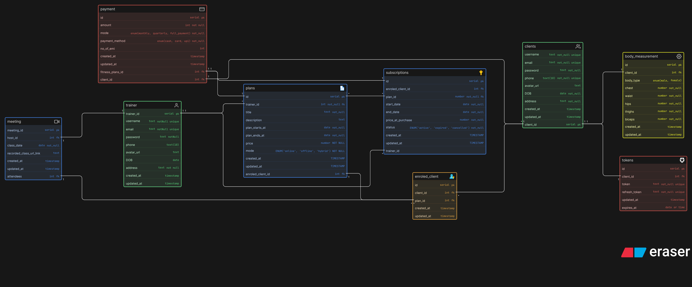
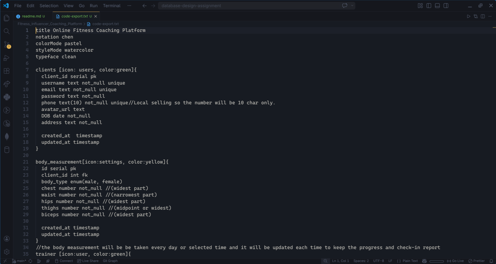

# Online Fitness Coaching Platform – Database Design

This project is a database design for an online fitness coaching platform built for influencers/trainers who want to scale their coaching business beyond Instagram DMs and video calls.

As the business grows, managing clients, plans, payments, sessions, and progress manually becomes messy.
This system organizes everything into a structured and scalable database.

---

🚀 Project Goal

The goal of this database is to support a complete online coaching ecosystem where:

Trainers manage multiple clients
Clients can enroll in different fitness plans
Payments and subscriptions are tracked
Sessions and consultations are scheduled
Client progress (body measurements) is stored over time

---

# Core Features Covered

### This design supports:

-> Client onboarding  
-> Trainer management  
-> Fitness plan creation  
-> Plan enrollment (subscriptions)  
-> Payment tracking  
-> Session/meeting scheduling  
-> Progress tracking (body measurements)

---

## ER Diagram Preview

## Eraser Whiteboard

### View the interactive diagram: **[Open in Eraser](https://app.eraser.io/workspace/1206tS0VU0tb9UxP1r3W?origin=share)**

## Code

View the code file as some comment are written for better understanding of the digram, thank you

## [View the source code](./code-export.txt)

