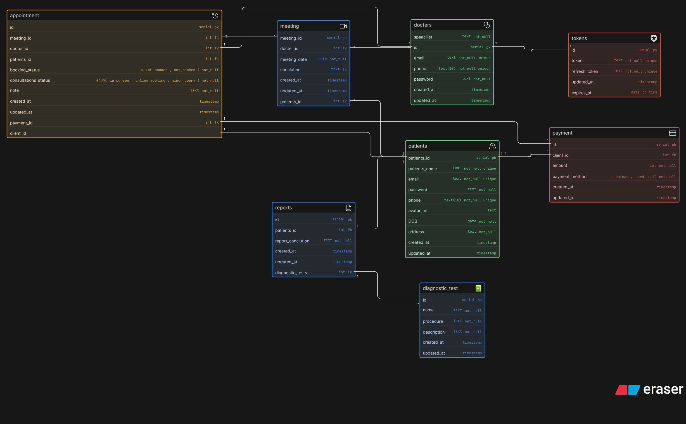
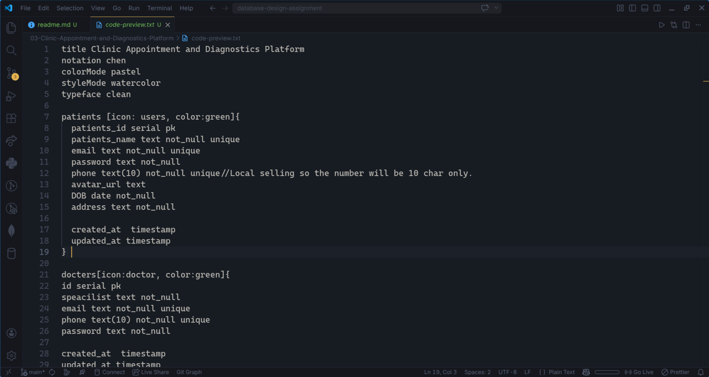

# Clinic Management System - ER Diagram Implementation

### Overview

This document outlines the database schema and Entity-Relationship (ER) design for a modern digital clinic. The system is designed to efficiently handle patient flow, from booking an appointment to the doctor's consultation, diagnostic testing, report generation, and final payment.

The architecture prioritizes scalability and data integrity, ensuring a clean separation of concerns without overcomplicating the design into a massive hospital-level system.

Key Design Decisions
The design addresses several specific operational scenarios of a modern clinic:

Appointments vs. Consultations: These are separated into two distinct entities. An Appointment represents the intent to visit (which can be cancelled or rescheduled). A Consultation represents the actual visit and medical encounter. One appointment can result in zero (if cancelled) or one consultation.

Specialties as a Separate Entity: Instead of a simple text attribute, Specialty (or Department) is a dedicated table. This prevents data entry errors and makes it simple to query, for example, "all available dermatologists."

Linking Diagnostic Tests: Tests are strictly linked to the Consultation entity, not the appointment or the patient directly. This accurately reflects reality: a doctor prescribes a test based on the findings of a specific visit.

Handling Multiple Tests: A Many-to-Many resolution table (Consultation_Tests) connects a single consultation to multiple diagnostic tests from the clinic's master test catalog.

Report Generation: Reports are linked directly to the specific prescribed test (Consultation_Tests). This ensures that if a patient takes the same blood test on different dates, the results are perfectly isolated to the correct visit.

Payments: The Payment entity is linked to the Consultation (or an intermediate Invoice entity). This allows the clinic to bill the patient for the doctor's consultation fee plus any diagnostic tests prescribed during that specific visit.

---

## ER Diagram Preview

## Eraser Whiteboard

### View the interactive diagram: **[Open in Eraser](https://app.eraser.io/workspace/pG5Cod6hA73nDe93A1C9)**

## Code

View the code file as some comment are written for better understanding of the digram, thank you

## [View the source code](./code-export.txt)

