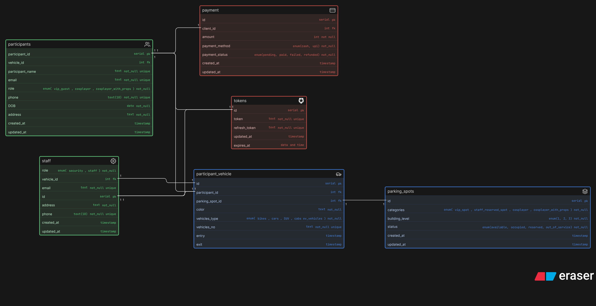
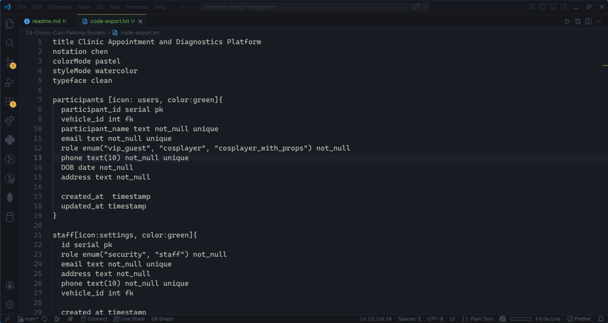

# Comic-Con Parking System

This project presents the design of an Entity-Relationship Diagram (ERD) for a multi-zone parking management system tailored for large-scale events such as Comic-Con India. The system is designed to efficiently manage the influx of thousands of visitors arriving with different types of vehicles over multiple days.

## The parking facility is structured into various zones and levels, with specific areas reserved for VIP guests, staff members, exhibitors, cosplayers (with or without props), and electric vehicles (EVs). The system ensures seamless parking spot allocation, ticket generation, session tracking, and payment processing.

## ER Diagram Preview

## Eraser Whiteboard

### View the interactive diagram: **[Open in Eraser](https://app.eraser.io/workspace/fVx2Dj4yWmyWFDbLsvpz)**

## Code

View the code file as some comment are written for better understanding of the digram, thank you

## [View the source code](./code-export.txt)

