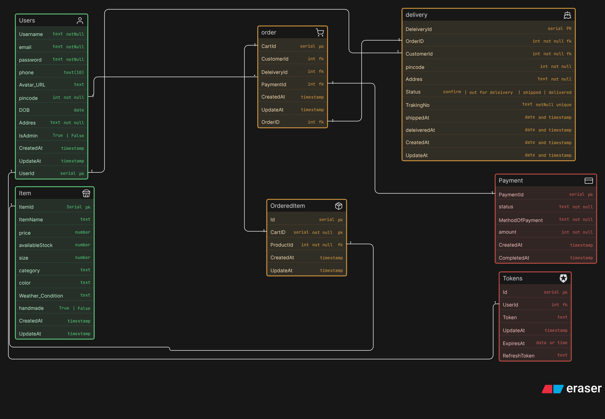

# Thrift & Handmade Store Database

This project is an **Entity Relationship (ER) design** for a small e-commerce system built for selling **thrifted** and **handmade** products.  
It is designed to manage users, items, orders, payments, delivery details, and authentication tokens in a clean and organized way.

The main goal of this database is to keep the store data structured so that products can be tracked properly, orders can be managed easily, and customer information stays consistent across the system.

---

## Project Overview

This database helps handle the full flow of an online store:

- A user signs up and logs in
- They browse available items
- They place an order
- Payment is recorded
- Delivery information is tracked
- Tokens are stored for authentication and session management

The design is simple enough for a student project, but also realistic enough to reflect how a real-world e-commerce backend works.

---

## ER Diagram Preview

